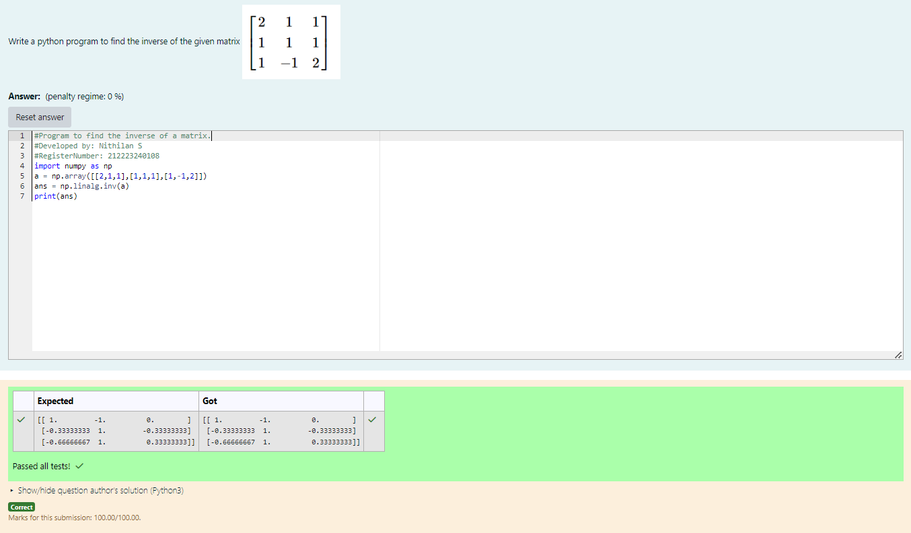

# INVERSE-OF-A-MATRIX
## Aim:
To write a python program to find the inverse of a matrix
## Equipment’s required:
1. 	Hardware – PCs
2. 	Anaconda – Python 3.7 Installation / Moodle-Code Runner
## Algorithm:
### Step1 : 
Import the numpy module to use the built-in functions for calculation.
### Step 2: 
Prepare the lists from each equations and assign in np.array().
### Step 3: 
Using the np.linalg.matrix_rank(), we can find the inverse of the given matrix.
### Step 4: 
End the program.
## Program:
```python
import numpy as np
a = np.array([[2,1,1],[1,1,1],[1,-1,2]])
ans = np.linalg.inv(a)
print(ans)
```
## Output:

## Result:
Thus the inverse of given matrix is successfully solved using python program

